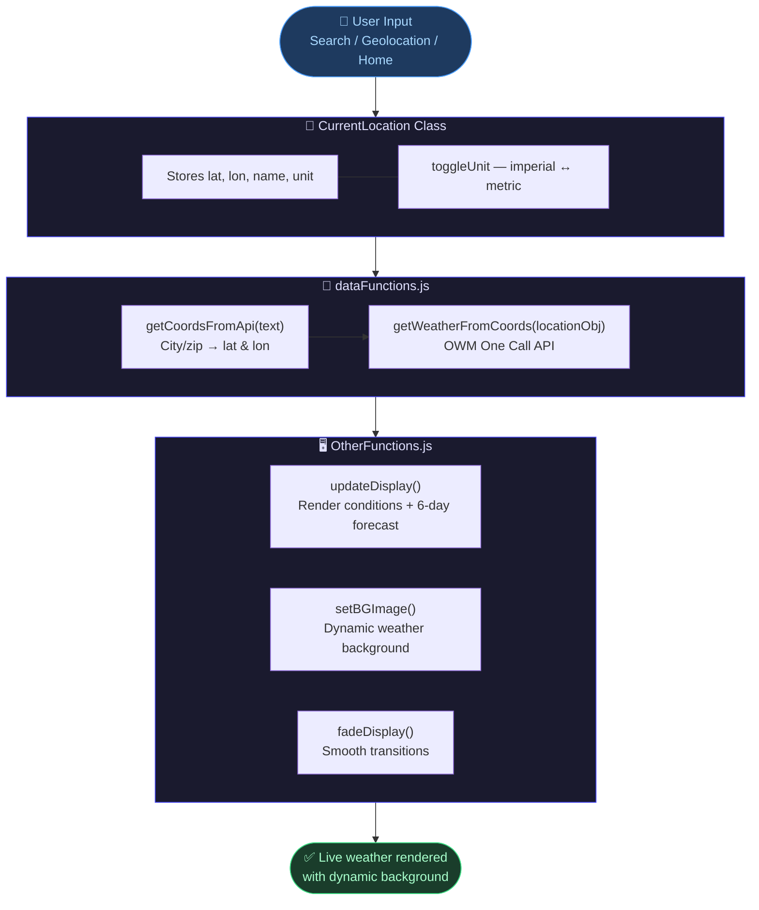

<div align="center">

# 🌤️ Weather App

### *A responsive weather app powered by the OpenWeatherMap API — search any city, save your home location, and get a live 6-day forecast with dynamic backgrounds.*

<br/>

[](https://developer.mozilla.org/en-US/docs/Web/JavaScript)
[](https://openweathermap.org/api)
[](https://fontawesome.com)
[](https://developer.mozilla.org/en-US/docs/Web/HTML)
</div>

---

## ✨ Features

- 🔍 **Search** by city, state, country or zip code
- 📍 **Geolocation** — detect your current location automatically
- 🌡️ **Unit toggle** — switch between °F (imperial) and °C (metric)
- 📅 **6-day forecast** with daily high/low and weather icons
- 🌅 **Dynamic backgrounds** — changes based on weather conditions (rain, snow, fog, night, clouds)

---

## 🏗️ Architecture



---


## 🚀 Getting Started

### 1. Clone the repo

```bash
git clone https://github.com/your-username/weather-app.git
cd weather-app
```

### 2. Add your API key

In `dataFunctions.js`, replace the key:

```js
const WEATHER_API_KEY = 'your_openweathermap_api_key';
```

> Get a free key at [openweathermap.org](https://openweathermap.org/api). The app uses the **Current Weather** and **One Call** endpoints.

### 3. Open in browser

```bash
# No build step needed — open directly
open index.html
```

---

## 📁 Project Structure

```
weather-app/
│
├── javascript/weather javascript/
│   ├── main.js               # App init, event listeners, flow control
│   ├── dataFunctions.js      # API calls, location object helpers
│   ├── OtherFunctions.js     # DOM updates, display, animations
│   └── CurrentLocation.js    # Class — stores location & unit state
│
├── stylesheet/weather2 css/
│   └── main.min.css
│
├── weather scss/
│   └── main.css
│
└── index.html
```

---

## 🛠️ Tech

| | |
|---|---|
| **Language** | Vanilla JavaScript (ES6 Modules) |
| **API** | OpenWeatherMap — Current Weather + One Call |
| **Icons** | Font Awesome 5 |
| **Styling** | SCSS compiled to CSS |